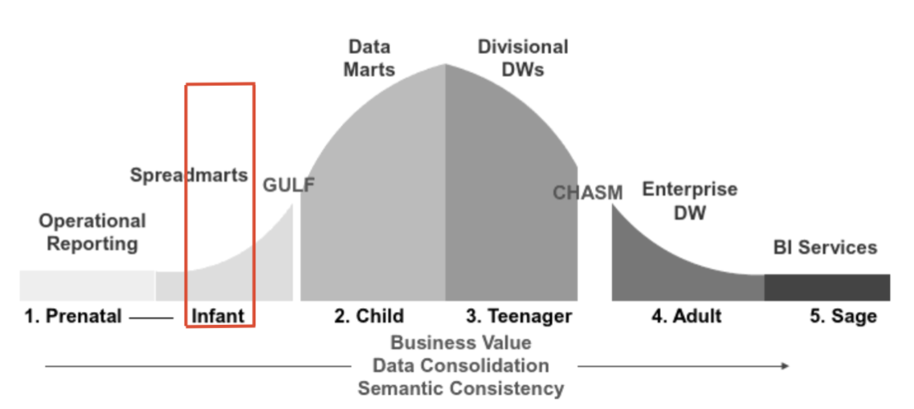
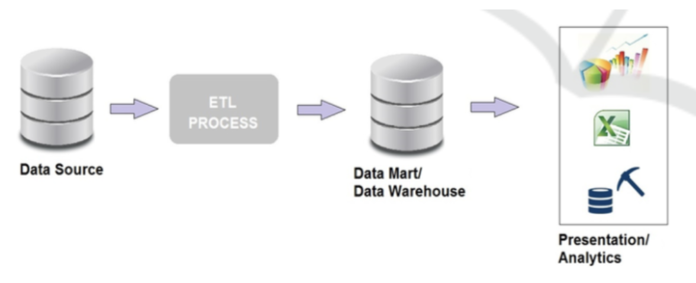
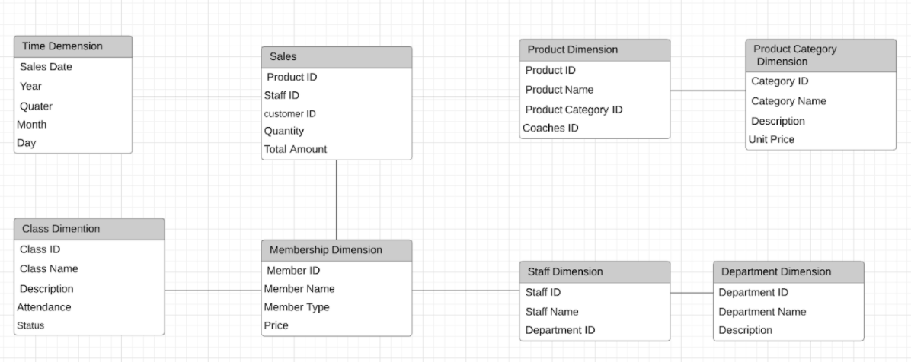
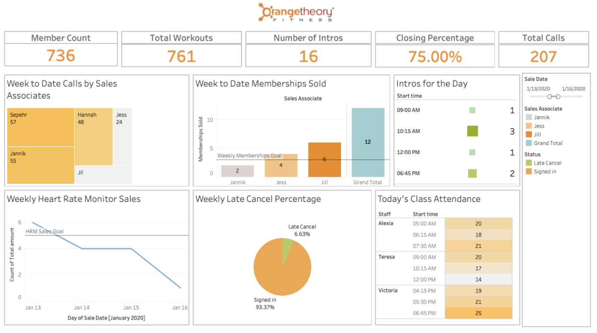
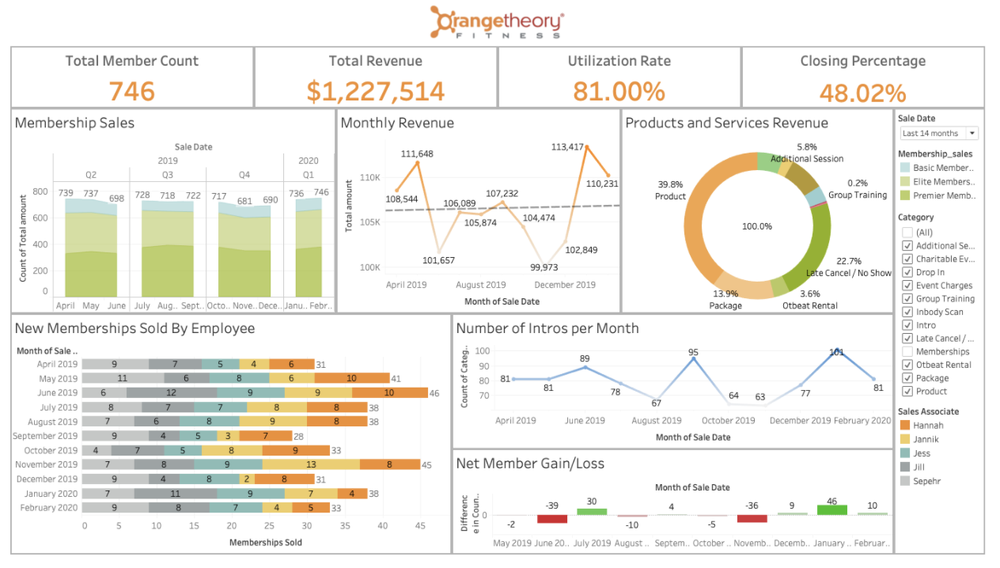
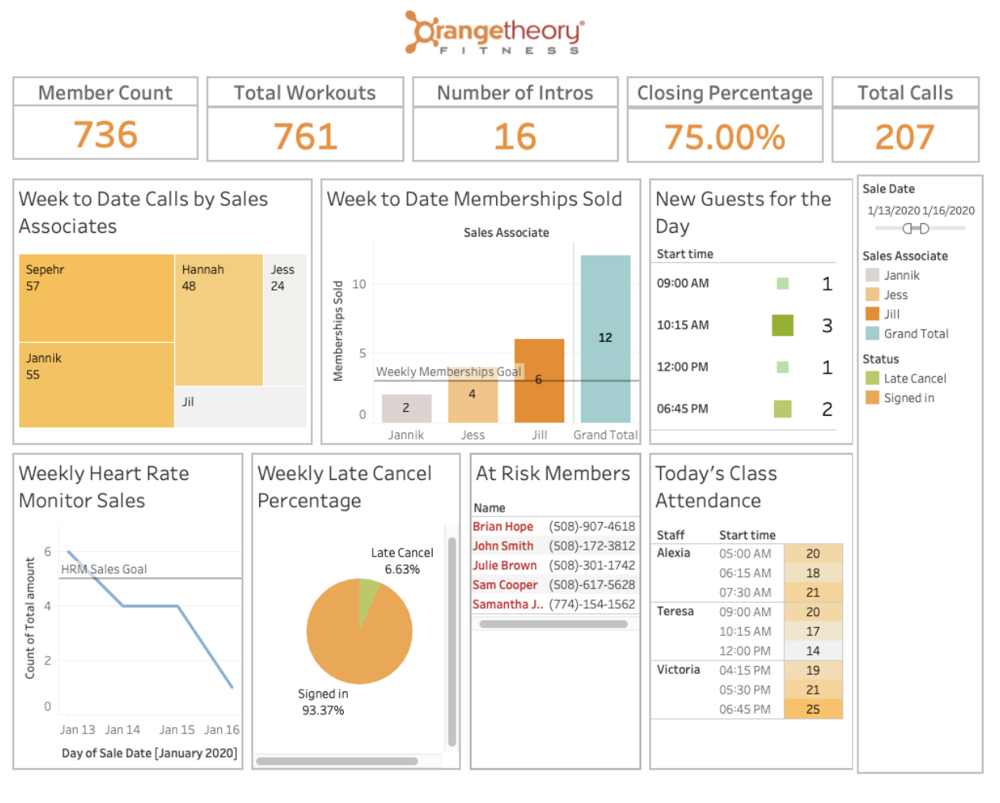

# Business Intelligence for Orangetheory Fitness

**Team Members:** Hamidullah Sakhi, Jannik Haas, Ruyun Chen, Zixin Li

Worcester Polytechnic Institute (WPI)

## Executive Summary 
This document acts as a feasible solution for Orangetheory Fitness. The goal is to evaluate the possible solutions and benefits that business intelligence (BI) can offer the company.

To do a thorough feasibility analysis, our team first did a review of the current standing stage based on the BI maturity model for the company. We found that the company stands on the 'infant' stage, which means that the company is using mainly MS Excel for their daily reports and analysis.  

Based on the client’s requirement and the data that she provided, we developed the solutions consisting of two dashboards, which are developed in Tableau and predictive analysis, which is done in R.

- Operational Dashboard: This dashboard is for sales associates and coaches. Sales associates can see performance based on the number of calls and the number of memberships they have sold. Consequently, coaches can have an overview of their classes and Status of the attendants.
- Strategic Dashboard: This dashboard is for managers and shows a summarized status of the franchise as well as financial, sales, and employees performance KPIs. 
- Predictive Analysis: Using R language and decision tree model, the predictive analysis is showing the number of members who are at risk of losing.

For the successful and effective implementation, we provide suggestions and guidelines that address both managerial and technical aspects:

- Managerial: For change management, we suggest to follow Kotter’s model. 
- Technical: For the technical implementation, we suggest the company to focus on four stages: data storage, data collection, data quality, and data visualization.  We have described each step in detail with the recommended tools and technologies.  

## Introduction
### Client Company Background
Orangetheory Fitness is a boutique fitness studio franchise and has more than 1200 studios in 23 countries. Each franchise store independently owns each location. As a fitness studio, OTF provides heart rate-based group exercise courses to allow members to achieve weight loss. Workout sessions are group exercises led by certified coaches. Each member has the option to wear a heart rate monitor, which is synchronized to a screen displaying performance metrics for the entire class. The heart rate monitor will track and monitor member performance in real-time. After each workout, using the 360 Score, app statistics are sent to each member via email and mobile app. The primary source of revenue for OTF is monthly memberships. They also sell retail products as well as other fitness services.

We are working with one franchise location. The store in Shrewsbury has 730 members and 12 employees, including salesperson, coaches, and store manager.

### Current Status in term of Business Intelligence
Currently, the company uses MINDBODY, which is a cloud-based online scheduling and other business management software to manage workout performance summary for customers. OFT has always used advanced technology to provide customers with high-quality services. However, they lack BI solutions. The client franchise does not have a separate BI team or BI tools for daily business operations. They use Excel to store data and reporting.

The company sits on the 'Infant' stage of the BI maturity model. According to the dataset we get from the client company. However, the datasets contain different categories of sales data; we still met data quality issues such as non-standard data and duplicated data. They didn't consolidate multiple data sets and data rules to ensure data consistency through the store. Additionally, they haven’t implemented a BI program for its daily operation.

Our team conducts an in-depth analysis of the overall performance of the store through obtained datasets, and we also do member retention analysis and generate some practical suggestions based on the result. We hope that the operational, strategic dashboards and data analysis can provide OTF with more effective BI solutions while developing a shared analytic structure to support business processes.

Figure 1: BI Maturity Model

## The Proposed Business Intelligence Solution

### What is business intelligence
Business intelligence (BI) comprises the strategies and technologies used by companies for the data analysis of business information [1]. Business intelligence systems provide people with tools and methodologies that allow them to make useful and timely decisions through relevant information. It provides a visual view of performance data, including past, present, and future. By adopting a BI system, companies can easily predict market trends and set goals for each department. The valuable information allows companies to avoid making decisions in an uncertain environment as well as improve decision-making processes. 

### Main components of BI solutions

Figure 2 summarizes the main components of our BI solution for OTF. The main parts of our BI solutions are data source, data warehouse analytics, and data visualization tools. The data from business transactions need to go through the ETL(Extract-Transform-Load) process. Data is cleaned, converted, and reorganized into a data warehouse or data mart during this process. Figure 3 shows the snowflake schema of our designed data warehouse. The data analysis is guided by key performance indicators of our client organization. Then we will use a data visualization tool to present the result of data analysis to our client user. The result shows visual information about business performance and could guide client users to make effective decisions.

Our client company is Orangetheory Fitness, which is a fitness studio. The data set we got from the client includes sales reports, sales of products, and services. After understanding the business needs from the OTF manager, we select appropriate metrics and determine performance indicators. Some of the business performance indicators are membership sales, product and services revenue, class attendance, and the number of newcomers. Then we will encounter some data quality issues to prepare raw data. According to the data sets we have, we decided to build two dashboards and do some data analysis. The operational dashboard is mainly for sales associates and coaches. It focuses on daily operation and provides sales associates with weekly product sales information as well as class attendance status for coaches. The operational dashboard is for store managers to view long term sales revenue. Since member registration is the most crucial part of revenue, we decided to make data analysis to find technical ways to increase member retention rates and reduce the loss of members. These BI solutions focus on managerial questions that could get a deep insight into the overall performance of the store.

Figure 2: Main components of BI Solution

Figure 3: Snowflake Schema of data warehouse

## Three Use Cases/Prototypes
### Operational Dashboard

We have developed an operational dashboard for daily use by sales associates (SAs) in the studio, as well as the coaches' use. This interactive dashboard focuses on the day to day business operations. It provides SAs with crucial information about events happening that day as well as performance indicators for the current week. The timeline for the operational dashboard is daily and weekly, with two charts showing information for classes that day and the rest of the charts showing weekly performance. We have decided to set up the timeline this way because this is a small operation, and not all employees work every day, therefore we would not be able to gather much information from only daily graphs. The top row shows KPIs, which are as follows: Member Count is the total number of monthly members during the current month. From speaking with the manager, we gathered that this is a great metric to track studio growth, and displaying this month's value will give SAs a way to see where the studio stands. Total workouts are the number of workouts performed that week, which is an essential indicator for studio usage by members. The way that the studio brings in new people is by providing the first class for free, which is known as an intro. We have included the total number of intros for the week as one of the key performance indicators. An intro is also a potential member, and that is the point in which SAs attempt to sell the membership. The closing percentage is the percentage of intros that have signed up for a membership. Lastly, to get new intros into the studio, SAs make calls to potential leads to get them signed up. Therefore we have included the total number of calls as the last key performance indicator.

SAs are in charge of taking new guests through the intro process to make sure they can complete the workout safely and to get the full Orangetheory experience. For this reason they need to know which classes of the day have intros in them so they can adequately prepare. We have included the "Intros for the Day" chart to show which classes have intros and how many that way SAs can plan their day accordingly. "Today's Class Attendance" indicates the number of people signed up for each class throughout the day. This not only gives sales associates and coaches a better view of the amount of traffic in the studio that day, but also serves as a performance indicator since we want more members to come and take classes.

Since the primary source of new guests is from calls, we have included this week's sales calls broken down by sales associate to show which SA is making the most calls. Next, the "Week to Date Memberships Sold" indicates the number of memberships sold by each SA that week as well as a total. Memberships make up about 85% of the total revenue and a significant part of a SA’s job is to sell memberships; therefore, this is a reliable performance indicator for sales associates. In the bottom left of the dashboard is the "Weekly Heart Rate Monitor Sales'' chart, which shows how many heart rate monitors have been sold each day this week. It has been shown that a member that purchases a heart rate monitor when they sign up for a membership is much more likely to stay a member since they are better able to track their performance and progress. Therefore, we want to sell as many heart rate monitors as possible to improve our member retention rate. Lastly, the "Weekly Late Cancel Percentage" shows the percentage of people that late canceled a class (cancelled within 8 hours of the class). The average for this percentage for the data we received was 8% - as the number increases, that means a large number of people are signing up for classes and not coming for the class. When this becomes a habit, members are more likely to cancel their membership since they don't feel that they are getting used out of it, so we want to keep an eye out on this percentage.

**Managerial Questions:**
- How many intros do we have today?
- What classes have intros in them today?
- What is today’s class attendance for each class?
- How many intros have we had this week?
- How many memberships have each sales associate sold this week?
- How many total new memberships have we sold this week?
- How many calls have each sales associate made this week?
- How many heart rate monitors have we sold this week?
- What is the late cancel percentage like? Do we have an increase in at-risk members?
- How many members does the studio have?
- What is the closing percentage for the week? 
- What is the studio utilization for the week?

### Strategic Dashboard

We have also developed a strategic dashboard for use by the manager and owner of the studio. As mentioned above, the primary revenue for the studio comes from monthly memberships. Therefore, this dashboard focuses mostly on membership data as well as some product and additional services. It also provided employee performance data so the manager can evaluate their employees.
Starting at the top of the dashboard, we have included several KPIs as follows: the "Total Member Count" card shows the total number of members of the studio. The "Total Revenue" card displays the total revenue of the studio during the selected period. "Utilization Rate" is the percentage of spots taken up in classes to the total number of spots available. For example, most classes have a capacity of 28 people, and if the class has 20 people in it, the utilization rate will be 20/28. This is an essential number for studio managers and owners to keep track of as the number should not be so low that we are running very low classes. Still, we also don't want it to be 100% as then we will have a large number of members that are unable to get into classes. Therefore, keeping track of the utilization rate will give the manager a better understanding of when to add to or remove classes from the schedule. Lastly, we have included the average closing percentage for sales associates during the selected period for the manager to evaluate the over sales performance.

On the top left, we have the "Membership Sales" chart, which shows us the total number of members per month during the selected period, which will give the manager an understanding of the overall studio growth. Next, we have a chart showing the "Monthly Revenue" as well as the percentage of revenue coming from each product and service type in the “Products and Services Revenue” chart. We deselected the memberships category since they account for 85% of total income, so when it is selected, you are unable to see the detail in the rest of the categories. When you choose a category in the pie chart, the monthly revenue chart will only display revenue for that category allowing managers to see the performance of each specific category. On the bottom left, we have a chart showing the number of memberships sold by each employee during the selected period. This will give the manager a better overview of employee performance and can be a useful metric for bonuses or other incentives. We also included a chart to show the number of intros during the period since that is where the majority of new memberships come from. Lastly, the "Net Member Gain/Loss" graph shows whether we gained or lost members each month since membership sales alone don't show the complete picture due to membership cancellations. Both the Intros and Revenue charts can also change their timeline to either quarterly or weekly. 

On the right side, we have the legend as well as the date selection and category selection. Here a manager can change the entire dashboards timeline as well as selecting or deselecting specific categories from the "Products and Services Revenue" chart.

**Managerial Questions:**
- What was the revenue over the last year? Or a given period?
- How has the total number of members changed over a given period?
- What products and services are performing the best and bringing in the most revenue?
- What sales associates have been performing best?
- Are the number of classes we are offering adequate for our members?
- How many intros have we had per month/week/quarter over a given period? 
- What is the percentage of intros that we have been able to convert to members?
- How well are we retaining our members?

### Member Retention Analytics
Member retention is crucial in any business, but especially in fitness studios. Group fitness studios have reported an average membership retention rate of 75.9% (Curley, 2019). Although this is higher than their traditional fitness studio counterparts, there is still a lot of room for improvement. We have decided to focus our analytical efforts on increasing this number by predicting whether or not a member was going to cancel their membership so that the studio can focus their efforts on retaining these at-risk members. 

Because we had limited data from Orangetheory, we used a dataset from Kaggle from a Telecommunications company. This dataset includes 19 predictive features (see Appendix A) as well as whether or not the customer churned (canceled their contract). The churn rate for this dataset was 26.58%, which is comparable to the average churn rate for fitness studios of 24.1%.  
For our classification algorithms, we first balanced the dataset using the Synthetic Minority Oversampling Technique (SMOTE) to reduce the imbalance bias. We also performed data preprocessing to make sure all the features were correctly identified as factors or numerical values and omitted all empty values. The data was then split into 70% training and 30% testing to train and evaluate the performance of each classifier.

We performed several classification algorithms, which were Decision Tree, Random Forest, and Logistic Regression (See Appendix B). A decision tree structures a tree with branches based on the features and leaves to classify them. At each branch there is a split based on the feature with each node classifying the class of the observation. Random forests are a collection of decision trees that were created by training the decision tree on only a section of the data and features. The goal of random forests is to increase the variance compared to decision trees, which will hopefully give the classifier higher predictive power. Logistic regression is the simplest of the three models where it attempts to create a linear equation based on the data and then uses the logistic function to map each observation between 0 and 1 and then to classify each observation based on this value.

Out of the three classifiers, Random Forest produced the best result with a misclassification rate of 17.4% or an accuracy of 82.6%. When looking at this type of problem, the error is made up of the false positive rate and the false-negative rate. For this specific application, the false-negative rate is the most critical error since that means we predict a member will not cancel their membership even though they actually will. We were able to achieve a false negative rate of only 7.4%. This is an excellent example of how powerful advanced predictive analytics truly is and can help to predict whether a customer would cancel their contract or not.

Orangetheory can use a classification model such as this one using features such as length of membership, number of monthly classes, number of days since the last visit, retail purchases, membership type, and general demographic information. This will allow the model to generate a list of customers that are in danger of canceling their memberships such that Orangetheory can focus their efforts to retain these specific customers. Small actions such as offering a free additional class or retail item can make a big difference in giving a personal connection to a customer to retain them. Orangetheory can also use the operational dashboard we have provided and add a small section with a list of at-risk members and have sales associates reach out to these members to increase the studio’s retention rate and thereby increase overall profits. 

## Implementation 
There are different approaches to implementing a BI solution. This could vary significantly based on the size and the IT budget of the company, as well as the company’s knowledge in the BI field. For Orangetheory, there are two aspects that they should attach great importance to. Firstly, a managerial perspective. As we all know, implementing changes can be an intimidating prospect because people are always unwilling to change things that they are familiar with. So, when a significant change occurs, great leadership makes a difference. For the Orangetheory management level, we recommend they follow Kotter's eight steps and pay more attention to the planning stage. They can analyze the pros and cons, such as changes in technology and market demand,  and frequently communicate with employees about the changes and requirements. Also, they can establish the KPIs required to be measured, such as the total revenue, membership count, and once they have achieved some, employees can be rewarded. Finally, they can talk about the progress of each change and collect feedback from employees to see what they need for the future. 

Secondly, for a technical perspective, we recommend they mainly focus on four stages: Data storage, Data collection, Data Quality, and Data visualization. The source business data such as sales, coaches, and customer timesheet information will be stored in the data mart. Later on, the data from the source would be transformed and stored in a data warehouse. A data warehouse could be designed based on two kinds of schema: Star Schema or Snowflake. Star Schema consists of fact tables linked to dimension tables using primary/foreign key relationships. Whereas, Snowflake Schema consists of hierarchical relationships in a dimension table, with normalized, low-cardinality attributes appearing as secondary tables connected to the base dimension table by an attribute key. For this project, we will use a combination of them. During the data preparation part, according to the data provided, we encountered three main data quality issues. 1. Too much detailed data. We have a variety of products such as water bottles, hats, etc.. It would be complicated in a dashboard if we show everything, so what we do is to group them based on a specific type. 2. Duplicated data. For example, the same membership information is entered multiple times in the same excel, which is useless and incorrect. We use the data deduplication method to handle it. 3. Non-standard data. It means that information is input using non-standard formats or formats that cannot be processed by the system. The output of the data analysis process is presented as business intelligence to the end-users. We use Tableau to show the results of data analysis to company managers, which can handle a considerable volume of data with better performance.

Also, we will encounter some challenges in BI implementation. Our project scope is only for one franchise location, which is a small business. With a relatively low base, it typically does not have enough financial and human resources to invest in new technologies such as BI systems that do not core to their businesses (Raj, R., Wong, S. H., & Beaumont, A. J, 2016).  However, there are still some cost-effective solutions to BI exist, and an efficient BI solution can give such a small company a competitive advantage. For example, a standard BI solution is shipped as part of Microsoft’s flagship product. Companies having an MSDN license can have access to Microsoft’s standard BI solution at no extra cost, which is a great way to implement BI. 

What we have done and recommend is just a first step in implementing a BI solution to the Orangetheory. Our next step includes using BI to (1) upsize to add more locations for Orangetheory and achieve further potential enhancements within the organization, (2) use a separate dashboard for membership retention, which would be more specific and accurate. 

## Summary and Conclusion
We introduced to the business the current standing of it in the BI maturity model. We provided BI implementation cases, which we think that Orangetheory can adapt for it’s BI implementation. We also proposed three solutions for the initial BI implementation, which includes two dashboards in Tableau and one predictive analysis in R. 

Each dashboard can answer predefined questions that are effective for the targeted audience, and the predictive analysis is providing a showcase that will help Orangetheory to predict the likelihood of keeping or losing a member.

We also addressed the steps and approaches needed for the successful implementation of the project. We discussed not only the technical side of BI but also the managerial side as well, which has the same importance.

We realize that this solution is only the starting phase, and our work comes with limitations and challenges. These challenges include focusing only on one franchise and not having adequate data. We realize that there are lots of things to do to transform Orangetheory to reach the 'adult' or 'sage' stage. We identified those works and suggested guidelines and tools that would ease the implementation. 

## References
BlastChar. (2018, February 23). Telco Customer Churn. Retrieved April 20, 2n.d., from https://www.kaggle.com/blastchar/telco-customer-churn

Curley, E. (2019, January 24). Gym Membership Retention Statistics 2019. Retrieved April 27, 2020, from https://www.glofox.com/blog/the-gym-membership-retention-statistics-worth-retaining-in-2019/

Nedim Dedić, C. S. (2016). Measuring the Success of Changes to Existing Business Intelligence Solutions to Improve Business Intelligence Reporting. Business Information Processing, 225. Retrieved from https://en.wikipedia.org/wiki/Business_intelligence

Nedim Dedić, C. S. (2016). An Evaluation of the Challenges of Multilingualism in Data Warehouse Development. Retrieved from https://en.wikipedia.org/wiki/Star_schema

Paulraj Ponniah, (2010). Data Warehousing Fundamentals for IT Professionals. Retrieved from
https://en.wikipedia.org/wiki/Snowflake_schema

Raj, R., Wong, S. H., & Beaumont, A. J. (2016). Business Intelligence Solution for an SME: A Case Study.
